# 🏛️ Architecture Document — Blinkit Discovery Engine

> **Project**: Blinkit Cross-Category Discovery Pulse  
> **Version**: 2.0  
> **Status**: Active  
> **Last Updated**: 2026-07-15

---

## 1. Purpose & Scope

This document describes the **complete system architecture** of the Blinkit Discovery Engine — an automated, AI-powered pipeline that transforms unstructured user feedback (App Store/Play Store reviews, Reddit) into validated cross-category discovery insights, delivered to product stakeholders via a **Custom FastAPI Dashboard and RAG Chatbot**.

> [!IMPORTANT]
> The architecture is designed around a single business objective: break users out of their "tunnel vision" grocery habit loop and drive cross-category purchases into high-margin expansion categories — **Pet Care, Beauty & Personal Care, Home Needs, Electronics, and Baby Care**.

---

## 2. System Design Principles

| Principle | How It's Enforced |
|-----------|------------------|
| **Separation of Concerns** | Each layer (Ingestion, Processing, Insights, Validation, Delivery, Dashboard) is an independent module with no cross-layer imports |
| **Secure Configuration** | API keys (Groq, etc.) are strictly kept in .env files and never hardcoded in `src/` |
| **Hallucination-Resistant** | All LLM outputs pass 4-checkpoint validation before reaching the final report |
| **Idempotent Runs** | Re-running the same month produces no duplicate Doc sections or Gmail drafts |
| **PII-First Safety** | PII scrubbing is enforced at the ingestion boundary — raw text never reaches an external LLM API |
| **Modular Extensibility** | Adding new data sources or delivery channels requires only a new module — core pipeline is untouched |
| **Read-Only Dashboard** | Dashboard only reads from validated JSON files — it never writes to or modifies pipeline data |

---

## 3. High-Level Architecture

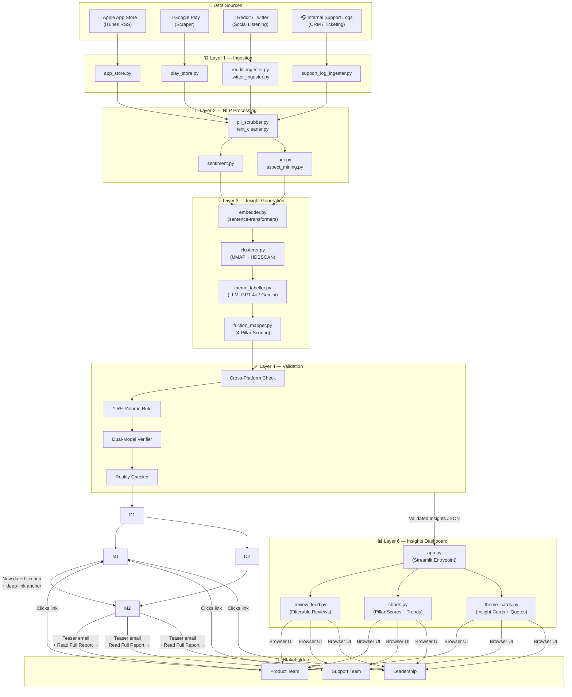

---

## 4. Layer-by-Layer Architecture

### Layer 1 — Data Ingestion

**Responsibility**: Collect raw unstructured text from all data sources, normalize to a standard schema, and write to the local raw data store. No processing occurs at this layer.

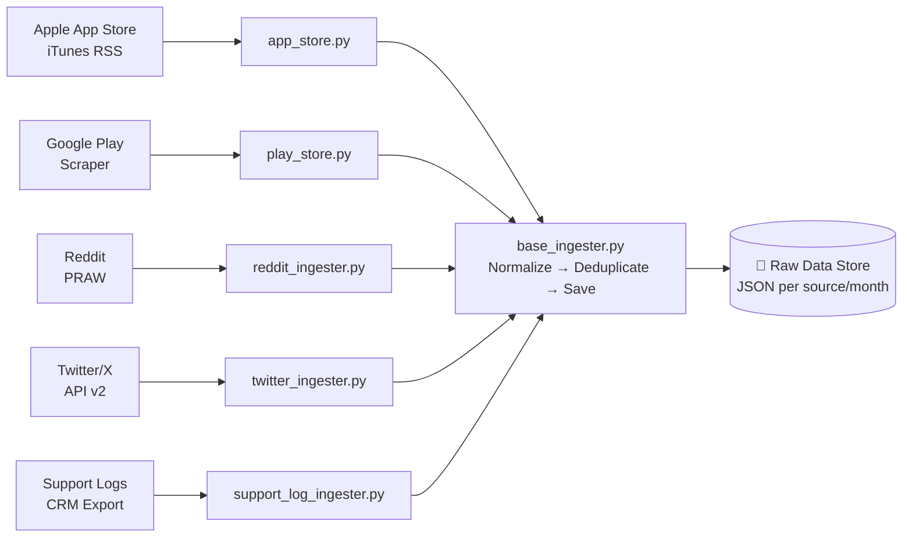

**Standard output schema (all sources):**
```json
{
  "platform": "app_store | play_store | reddit | twitter | support",
  "review_id": "stable_unique_id",
  "rating": 1,
  "text": "raw review text",
  "date": "YYYY-MM-DD",
  "author_id_hash": "sha256_of_author_identifier"
}
```

**Key design decisions:**

| Decision | Rationale |
|----------|-----------|
| All sources share `base_ingester.py` abstract class | Enforces `fetch()`, `normalize()`, `save()` contract for every source |
| Author ID is hashed at ingestion | Prevents PII propagation downstream before scrubbing |
| Deduplication by `review_id` at ingestion | Eliminates duplicates from re-runs or overlapping scrape windows |
| 30-day rolling window (configurable) | Balances recency with sufficient volume for statistical significance |

---

### Layer 2 — NLP Processing

**Responsibility**: Sanitize raw text (PII removal, deduplication, language filtering), then extract structured signals — sentiment scores and aspect-entity pairs — per text chunk.

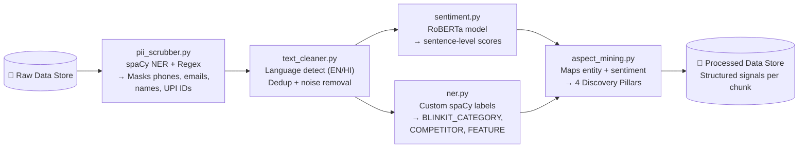

**Pillar Mapping — Aspect Dictionary:**

| Discovery Pillar | Signal Keywords |
|-----------------|----------------|
| 🔁 Habit & Velocity Barrier | "10 minutes", "grocery", "quick delivery", "replenishment", "habit", "same things" |
| 🔍 Trust & Information Gap | "authentic", "expired", "product details", "quality", "trust", "fake", "description" |
| 🖥️ UX Friction & Invisible Inventories | "search", "navigation", "can't find", "browse", "home screen", "discover", "hidden" |
| 🎯 Segment Propensity | "try", "explore", "first time", "switched", "new category", "surprised", "recommend" |

> [!CAUTION]
> `pii_scrubber.py` is a **mandatory gate**. No text from this layer or downstream may reach any external API (LLM, embedding model) without passing through it first. This is enforced in the pipeline orchestrator.

---

### Layer 3 — Insight Generation

**Responsibility**: Convert processed signals into semantically rich, named insight clusters mapped to discovery pillars — using embedding models, density-based clustering, and LLM-powered theme labelling.

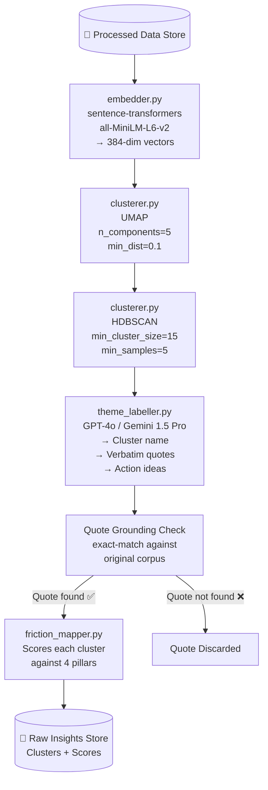

**Cluster schema (output of `theme_labeller.py`):**
```json
{
  "cluster_id": "c_001",
  "theme_name": "UX Friction in Category Discovery",
  "pillar": "UX Friction & Invisible Inventories",
  "confidence_score": 0.87,
  "review_count": 234,
  "corpus_percentage": 3.2,
  "sources": ["play_store", "reddit"],
  "verbatim_quotes": [
    "I couldn't find the pet section at all, it's buried",
    "The search is great for groceries but terrible for browsing"
  ],
  "action_ideas": [
    "Introduce a contextual discovery shelf on the home feed",
    "Add a 'Categories' tab with visual browsing for non-grocery items"
  ]
}
```

---

### Layer 4 — Insight Validation (Quality Control)

**Responsibility**: Filter raw LLM insights through 4 sequential checkpoints to ensure only statistically significant, factually grounded, cross-platform insights reach stakeholders.

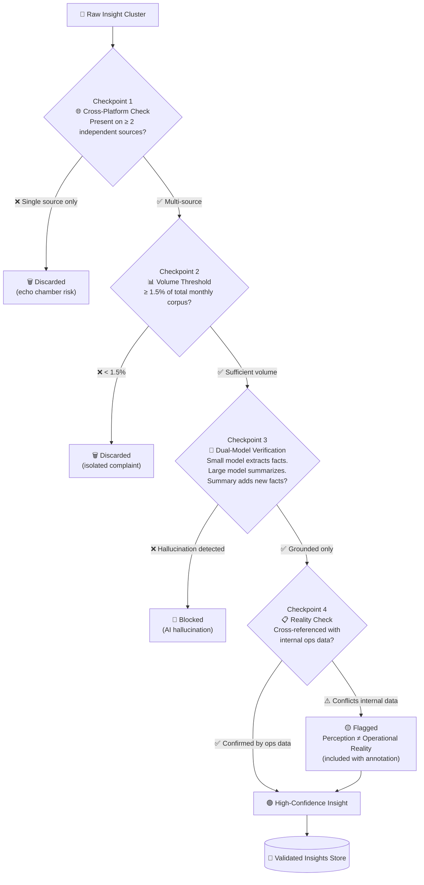

| Module | Checkpoint | Logic |
|--------|-----------|-------|
| `cross_platform_validator.py` | Cross-Platform | Insight cluster must have sources from ≥ 2 of: App Store, Play Store, Reddit, Twitter, Support Logs |
| `volume_threshold_filter.py` | Volume Rule | Cluster review count / total monthly corpus ≥ 1.5% |
| `dual_model_verifier.py` | Dual-Model | Uses `gpt-4o-mini` for fact extraction; `gpt-4o` for summarization. Diff check blocks hallucinated additions |
| `reality_checker.py` | Reality Check | Compares complaint category against Blinkit internal refund/ticket data export |

---

### Layer 5 — Report Rendering & MCP Delivery

**Responsibility**: Assemble validated insights into a structured one-page report, then deliver it exclusively through MCP-managed Google Docs and Gmail — with no Google credentials anywhere in the AI agent.

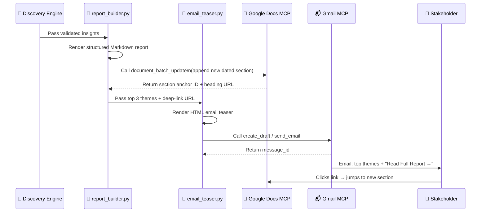

**Report structure per monthly run:**

```
📊 Blinkit Discovery Pulse — [Month YYYY]
Period: Last 30 days  |  Generated: [Timestamp IST]
═══════════════════════════════════════════════════
🏷️ TOP CROSS-CATEGORY THEMES
  1. UX Friction in Category Discovery — Confidence: HIGH (87%)
     Sources: Play Store + Reddit
     Quote: "I couldn't find the pet section at all, it's buried."
     Action: Introduce contextual discovery shelf on home feed

  2. Trust Gap in Beauty & Electronics — Confidence: HIGH (81%)
     Sources: App Store + Twitter
     Quote: "Not sure if the products are authentic here."
     Action: Add verified seller badges + expanded product detail pages
═══════════════════════════════════════════════════
📊 PILLAR BREAKDOWN
  UX Friction & Invisible Inventories  ████████░░ 78%
  Habit & Velocity Barrier             ███████░░░ 70%
  Trust & Information Gap              █████░░░░░ 52%
  Segment Propensity                   ████░░░░░░ 43%
═══════════════════════════════════════════════════
💡 RECOMMENDED ACTIONS
  1. Context-aware home feed (weekend → Pet Care surfacing)
  2. Verified seller badges for Beauty & Electronics PDPs
  3. "New for You" shelf for identified Segment Propensity cohort
```

**Idempotency mechanism:**

| Operation | Idempotency Mechanism |
|-----------|----------------------|
| Google Doc append | Stable HTML anchor `<!-- pulse-YYYY-MM -->` — checked before every append |
| Gmail send/draft | `message_id` written to `.pulse_ledger.json` — re-runs skip if ID exists |

---

## 5. MCP Integration Architecture

> [!IMPORTANT]
> The Discovery Engine is an **MCP host/client**. It holds zero Google API credentials. All authentication is owned by the MCP servers.

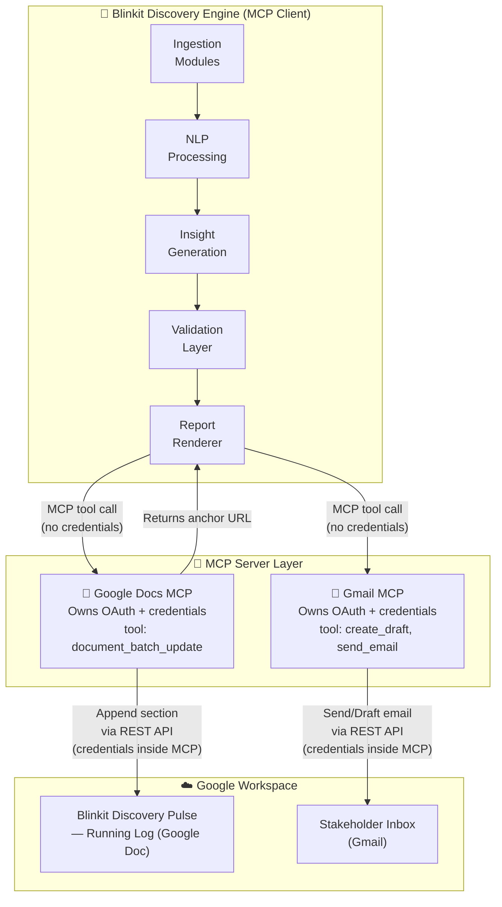

**Why MCP over direct REST API calls:**

| Concern | Direct REST API | MCP Approach |
|---------|----------------|-------------|
| Credential management | Agent holds OAuth secrets | MCP server owns secrets — agent is credential-free |
| Auditability | Calls are embedded in agent code | Every MCP tool call is logged at the server layer |
| Extensibility | Adding Slack/Notion requires new agent code + credentials | Add a new MCP server — agent code untouched |
| Security surface | Credentials exposed in `.env` + agent | Credentials never visible to or held by the agent |

---

## 6. Data Flow & Storage Architecture

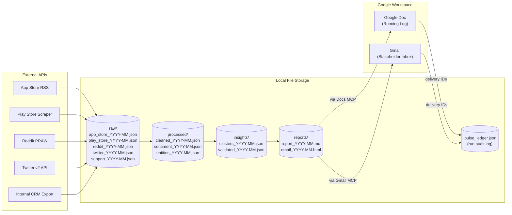

---

## 7. Monthly Scheduler Architecture

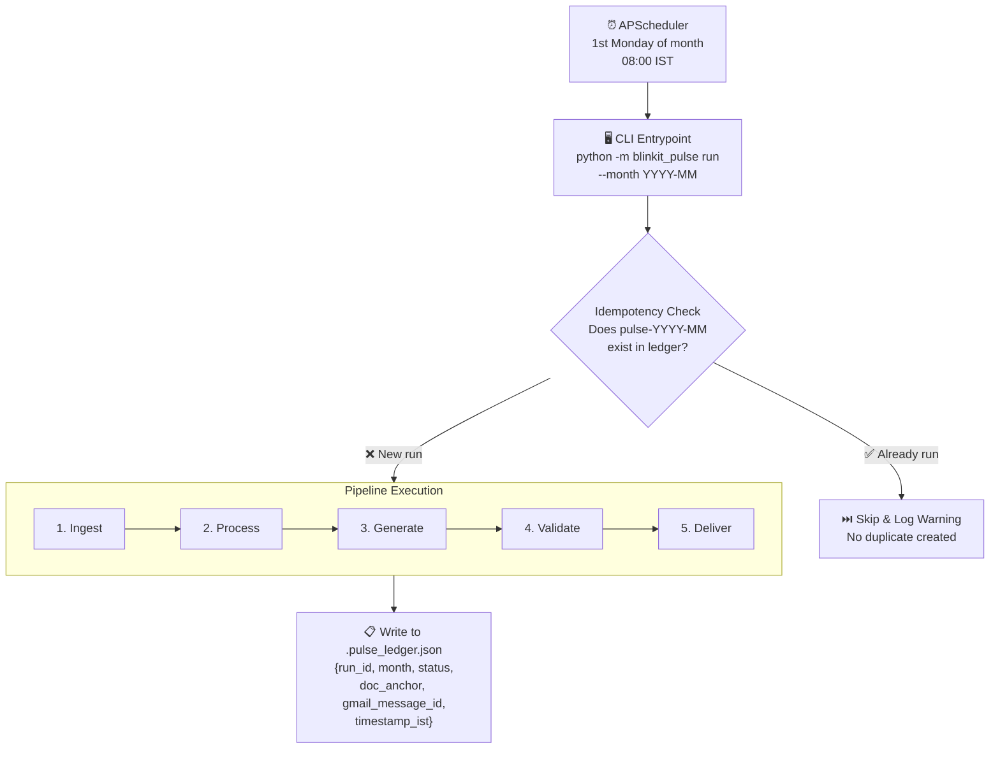

**CLI reference:**

```bash
# Automated (via cron/APScheduler)
python -m blinkit_pulse run

# Manual run for a specific month
python -m blinkit_pulse run --month 2026-07

# Dry-run (no MCP delivery — staging mode)
python -m blinkit_pulse run --month 2026-07 --dry-run

# Draft-only email (no send)
python -m blinkit_pulse run --month 2026-07 --draft-only
```

---

## 8. Module Dependency Map

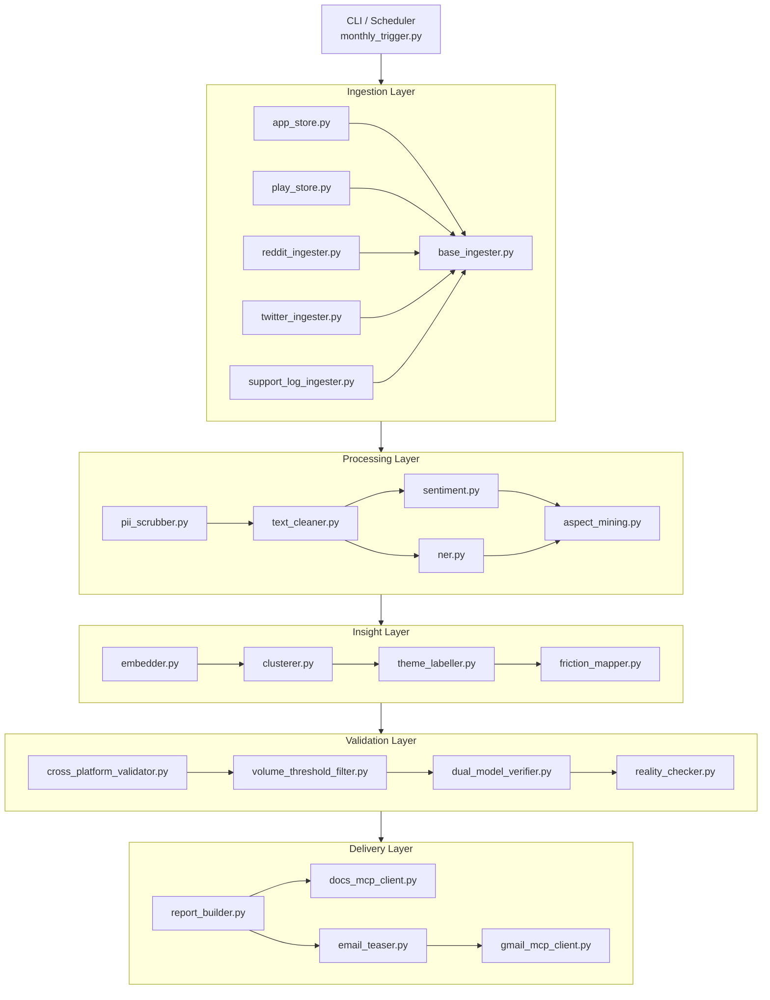

---

## 9. Security Architecture

| Threat | Mitigation Layer | Implementation |
|--------|-----------------|---------------|
| **PII in LLM prompts** | Ingestion boundary | `pii_scrubber.py` runs before any external API call |
| **Prompt injection via reviews** | Processing layer | Reviews treated strictly as data; never interpolated into system prompts |
| **OAuth credential exposure** | MCP separation | Credentials live only inside MCP server config; agent never touches them |
| **LLM hallucination** | Validation layer | Dual-model verifier + quote grounding check |
| **Duplicate delivery** | Idempotency | Doc anchor check + `message_id` ledger before every send |
| **API key leakage** | DevOps | `.env` never committed; GitHub Actions uses repository secrets |
| **Data exfiltration** | Scoped access | MCP servers grant narrowest possible Google Workspace permissions |

---

## 10. Full File Structure

```
Nextleap Graduation project Blinkit/
│
├── src/
│   ├── ingestion/
│   │   ├── base_ingester.py          ← Abstract: fetch(), normalize(), save()
│   │   ├── app_store.py              ← iTunes RSS reader
│   │   ├── play_store.py             ← google-play-scraper integration
│   │   ├── reddit_ingester.py        ← PRAW-based Reddit ingestion
│   │   ├── twitter_ingester.py       ← Twitter API v2 / snscrape fallback
│   │   └── support_log_ingester.py   ← Internal CRM/CSV export reader
│   │
│   ├── processing/
│   │   ├── pii_scrubber.py           ← spaCy NER + Regex PII removal (mandatory gate)
│   │   ├── text_cleaner.py           ← Language filter, dedup, normalization
│   │   ├── sentiment.py              ← RoBERTa sentence-level sentiment
│   │   ├── ner.py                    ← Custom spaCy NER for Blinkit entities
│   │   └── aspect_mining.py          ← Maps entities+sentiment → 4 pillars
│   │
│   ├── insights/
│   │   ├── embedder.py               ← sentence-transformers all-MiniLM-L6-v2
│   │   ├── clusterer.py              ← UMAP + HDBSCAN
│   │   ├── theme_labeller.py         ← LLM cluster naming + quote extraction + grounding
│   │   └── friction_mapper.py        ← Scores clusters against 4 discovery pillars
│   │
│   ├── validation/
│   │   ├── cross_platform_validator.py ← Checkpoint 1: ≥2 independent sources
│   │   ├── volume_threshold_filter.py  ← Checkpoint 2: ≥1.5% corpus volume
│   │   ├── dual_model_verifier.py      ← Checkpoint 3: hallucination detection
│   │   └── reality_checker.py          ← Checkpoint 4: internal data cross-reference
│   │
│   ├── delivery/
│   │   ├── report_builder.py         ← Assembles validated Markdown report
│   │   └── email_teaser.py           ← Renders HTML email with deep-link
│   │
│   ├── mcp/
│   │   ├── docs_mcp_client.py        ← Calls Google Docs MCP: document_batch_update
│   │   └── gmail_mcp_client.py       ← Calls Gmail MCP: create_draft, send_email
│   │
│   ├── dashboard/                    ← 🆕 Phase 5 — Streamlit Dashboard
│   │   ├── app.py                    ← Entrypoint; sidebar + page routing
│   │   ├── data_loader.py            ← Reads validated_YYYY-MM.json
│   │   ├── charts.py                 ← Pillar bars, trend lines
│   │   ├── review_feed.py            ← Filterable review table
│   │   └── theme_cards.py            ← Insight cluster cards + quotes
│   │
│   └── scheduler/
│       └── monthly_trigger.py        ← APScheduler: 1st Monday 08:00 IST
│
├── tests/
│   ├── test_ingestion.py
│   ├── test_processing.py
│   ├── test_validation.py
│   └── test_mcp_delivery.py
│
├── data/
│   ├── raw/                          ← Raw ingested JSON per source/month
│   ├── processed/                    ← Cleaned, sentiment-tagged, entity-tagged
│   ├── insights/                     ← Cluster JSON + validated insights
│   └── reports/                      ← Final report Markdown + email HTML
│
├── config/
│   ├── settings.yaml                 ← Window size, volume threshold, model names
│   └── mcp_servers.json             ← MCP server endpoints + tool definitions
│
├── docs/
│   ├── problemstatement.md
│   ├── implementation_plan.md
│   └── architecture.md              ← This file
│
├── .pulse_ledger.json               ← Run audit log (auto-generated)
├── .env                             ← API keys (never committed)
├── pyproject.toml
└── README.md
```

---

> [!TIP]
> When extending this system, follow the **single responsibility principle per layer**. Adding a new data source = new file in `src/ingestion/`. Adding a new delivery channel (e.g., Slack) = new MCP client in `src/mcp/` + new MCP server. The core pipeline orchestrator in `monthly_trigger.py` should not change.

---

## 11. Layer 6 — Insights Dashboard

**Responsibility**: Provide a browser-based, read-only view of validated insights, raw review feeds, pillar scores, and month-over-month trends — accessible to any stakeholder without needing Google Docs access.

> [!NOTE]
> The dashboard is a **pure read consumer**. It reads from `data/insights/validated_YYYY-MM.json` files already produced by Layer 4. The core AI pipeline does not change.

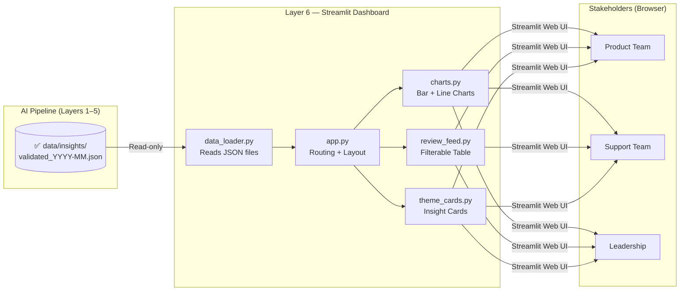

### Dashboard Panels

| Panel | Component | What It Shows |
|-------|-----------|---------------|
| 📊 Pillar Scores | `charts.py` | Horizontal bar chart: Habit Barrier, Trust Gap, UX Friction, Propensity |
| 📈 Monthly Trend | `charts.py` | Line chart of pillar scores across all past months |
| 🏷️ Top Themes | `theme_cards.py` | Cards: theme name, confidence score, pillar, action ideas |
| 💬 Real User Quotes | `theme_cards.py` | Expandable quote blocks per validated cluster |
| 📋 Review Feed | `review_feed.py` | Paginated, filterable table: source, rating, date, text, sentiment |

### Review Feed Filters

```
Filters available in sidebar:
├── 📅 Month selector        → All available validated run months
├── 🗂️ Source               → App Store | Play Store | Reddit | Twitter | Support
├── ⭐ Star Rating           → 1★ | 2★ | 3★ | 4★ | 5★ (multi-select)
├── 🏷️ Category              → Pet Care | Beauty | Electronics | Home | Baby Care
└── 🔍 Free-text search      → Searches across review body text
```

### Updated File Structure (Dashboard Addition)

```
src/dashboard/               ← 🆕 New module (Phase 5)
├── app.py                   ← Streamlit entrypoint; page routing + sidebar
├── data_loader.py           ← Reads validated_YYYY-MM.json; caches with @st.cache_data
├── charts.py                ← Pillar score bars, monthly trend lines (Plotly / Altair)
├── review_feed.py           ← Filterable review table with pagination
└── theme_cards.py           ← Insight cluster cards with quotes + action ideas
```

**Run locally:**
```bash
streamlit run src/dashboard/app.py
```

**Deploy (optional — free):**
```bash
# Push to GitHub, then connect at share.streamlit.io
# No server setup required
```
