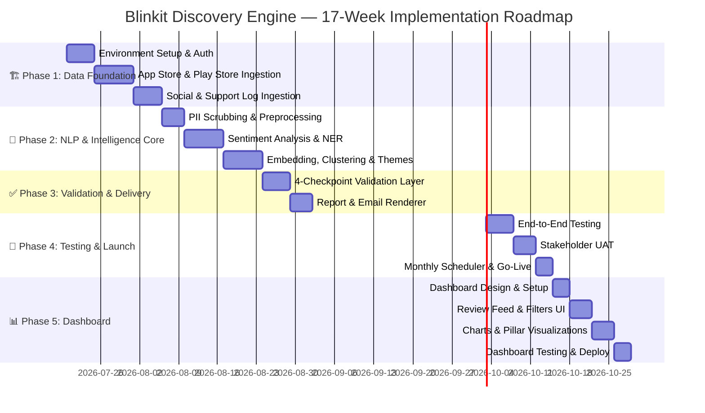
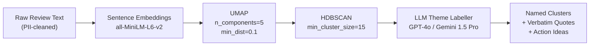
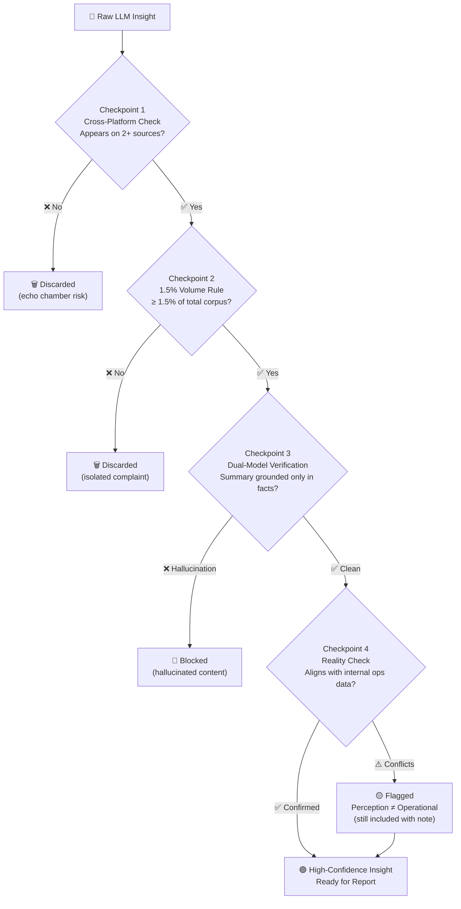

# 🗺️ Implementation Plan — Blinkit Discovery Engine

> **Project**: Blinkit Cross-Category Discovery Pulse  
> **Version**: 2.0  
> **Status**: Planning  
> **Last Updated**: 2026-07-15

---

## 📌 Overview

The Blinkit Discovery Engine is built across **5 phases** over **17 weeks**. Each phase has clearly defined goals, tasks, deliverables, and exit criteria before the next phase begins.

> [!IMPORTANT]
> **North Star Metric**: Quantifiably increase the % of Monthly Active Customers (MAC) purchasing from at least one non-core/new category (Pet Care, Beauty, Electronics, Home Needs, Baby Care) quarter-on-quarter — growing both AOV and LTV.

---

## 🗓️ Master Timeline



---

## End-to-End System Flow

```mermaid
flowchart LR
    subgraph P1["Phase 1 — Ingest"]
        A1[App Store Reviews]
        A2[Play Store Reviews]
        A3[Reddit / Twitter]
        A4[Support Logs]
    end

    subgraph P2["Phase 2 — Process & Analyse"]
        B1[PII Scrub & Clean]
        B2[Sentiment + NER]
        B3[Embeddings + Clustering]
        B4[LLM Theme Labelling]
    end

    subgraph P3["Phase 3 — Validate & Deliver"]
        C1[4-Checkpoint Validation]
        C2[Report Builder]
    end

    subgraph P4["Phase 4 — Test & Launch"]
        D1[E2E Tests + UAT]
        D2[Monthly Scheduler]
    end

    subgraph P5["Phase 5 — Dashboard"]
        E1[Streamlit Dashboard]
        E2[Review Feed + Filters]
        E3[Pillar Charts + Trends]
    end

    P1 --> P2 --> P3 --> P4 --> P5
```



---

## ══════════════════════════════════════════
## 🏗️ PHASE 1 — Data Foundation
## **Weeks 1–3 | Goal: Raw data in, clean schema out**
## ══════════════════════════════════════════

### 🎯 Phase Goal

Stand up all data ingestion pipelines so that raw, deduplicated reviews and social posts are reliably stored in a standardized JSON format and ready for NLP processing in Phase 2.

---

### 📋 Phase 1 Tasks

#### Task 1.1 — Project Environment Setup

| # | Task | Detail |
|---|------|--------|
| 1 | Initialize monorepo | Create `src/`, `tests/`, `config/`, `scripts/`, `docs/` directories |
| 2 | Configure `pyproject.toml` | Pin Python 3.12+; add core dependencies with `uv` / `pip` |
| 3 | Set up `.env` secrets | Store API keys for App Store, Play Store, Reddit, Twitter; never commit |
| 5 | Configure CI pipeline | GitHub Actions for linting (`ruff`) and test runners on every push |

---

#### Task 1.2 — App Store & Google Play Ingestion

```
src/ingestion/
├── base_ingester.py       ← Abstract base class: fetch(), normalize(), save()
├── app_store.py           ← iTunes RSS feed reader (configurable 30-day rolling window)
└── play_store.py          ← google-play-scraper library integration
```

**App Store:**
- Source: iTunes Customer Reviews RSS `https://itunes.apple.com/<country>/rss/customerreviews/...`
- Filter: Rolling 30-day window; capture all star ratings (1–5).
- Output schema:
```json
{
  "platform": "app_store",
  "review_id": "string",
  "rating": 1,
  "text": "string",
  "date": "YYYY-MM-DD",
  "author_id_hash": "sha256_hash"
}
```

**Google Play:**
- Library: `google-play-scraper` (Python).
- Pagination: Fetch up to 5,000 reviews per run; deduplicate by `review_id`.

> [!CAUTION]
> Rate-limit all scrapers. Implement exponential backoff (2ˣ seconds) to avoid IP bans or store blocks.

---

#### Task 1.3 — Social Listening Ingestion

```
src/ingestion/
├── reddit_ingester.py     ← PRAW library; targets r/blinkit, r/india, r/IndianStreetBets
└── twitter_ingester.py    ← Twitter API v2; monitors @blinkit, #blinkit hashtags
```

**Reddit:**
- Library: `PRAW` (Python Reddit API Wrapper).
- Target: Posts + comments mentioning Blinkit in relevant subreddits.
- Fallback: `snscrape` if API access is restricted.

**Twitter / X:**
- API: Twitter Developer API v2 (Bearer Token).
- Query: `blinkit OR @blinkit lang:en OR lang:hi`.
- Fallback: `snscrape` for historical pulls without API rate limits.

---

#### Task 1.4 — Internal Support Log Ingestion

```
src/ingestion/
└── support_log_ingester.py  ← Reads from internal CRM exports (CSV/JSON/S3)
```

- Accepts anonymized exports from the internal ticketing system (Freshdesk, Zendesk, etc.).
- Masks all customer-identifying fields (`customer_id`, `name`, `phone`, `email`) at ingestion boundary — **before any downstream processing**.

---

### ✅ Phase 1 Exit Criteria

- [ ] All 4 data sources produce valid, schema-consistent JSON output.
- [ ] Deduplication logic verified: no duplicate `review_id` in the output corpus.
- [ ] At least **1,000 reviews** successfully ingested from App Store + Play Store combined.
- [ ] PII masking applied at ingestion boundary for all internal support logs.
- [ ] CI pipeline runs lint and basic import tests successfully.

---

## ══════════════════════════════════════════
## 🧠 PHASE 2 — NLP & Intelligence Core
## **Weeks 4–7 | Goal: Raw text → actionable insight clusters**
## ══════════════════════════════════════════

### 🎯 Phase Goal

Transform the raw review corpus into structured, semantically rich insight clusters mapped to the **four discovery pillars** identified in the problem statement: Habit & Velocity Barrier, Trust & Information Gap, UX Friction, and Segment Propensity.

---

### 📋 Phase 2 Tasks

#### Task 2.1 — PII Scrubbing & Text Preprocessing

```
src/processing/
├── pii_scrubber.py    ← Regex + spaCy NER for phones, emails, names, UPI IDs
└── text_cleaner.py    ← Deduplication, language detection, noise removal, normalization
```

| Concern | Implementation |
|---------|---------------|
| Phone numbers | Regex: Indian formats `+91XXXXXXXXXX`, `0XXXXXXXXXX` |
| UPI IDs | Regex: `xxx@upi`, `xxx@paytm`, etc. |
| Names & Emails | spaCy `en_core_web_lg` PERSON + EMAIL entity labels |
| Language Filter | `langdetect` library — retain only `EN` and `HI` text |
| Deduplication | Hash review body; discard exact duplicates across sources |

> [!CAUTION]
> PII scrubbing runs **before any external LLM API call**. No raw support log or user review text may reach a third-party model without passing through `pii_scrubber.py` first.

---

#### Task 2.2 — Sentiment Analysis

```
src/processing/
└── sentiment.py    ← Aspect-level sentiment scoring per sentence
```

- **Model**: `cardiffnlp/twitter-roberta-base-sentiment-latest` (HuggingFace) — fine-tuned for social/informal text.
- **Granularity**: Sentence-level, not review-level, for aspect precision.
- **Output**: `{ text_chunk, aspect_keyword, sentiment: POSITIVE|NEGATIVE|NEUTRAL, confidence: 0.0–1.0 }`

---

#### Task 2.3 — Named Entity Recognition & Aspect Mining

```
src/processing/
├── ner.py           ← Custom spaCy NER for Blinkit-specific entities
└── aspect_mining.py ← Maps entities + sentiment → 4 discovery pillars
```

**Custom NER Labels:**

| Label | Examples |
|-------|---------|
| `BLINKIT_CATEGORY` | "Pet Care", "Beauty", "Electronics", "Baby Care" |
| `COMPETITOR` | "Zepto", "Swiggy Instamart", "BigBasket" |
| `FEATURE` | "search bar", "home feed", "Frequently Ordered" |
| `DELIVERY_ISSUE` | "late delivery", "wrong item", "damaged" |

**Pillar Mapping (Aspect Dictionary):**

| Discovery Pillar | Trigger Keywords |
|-----------------|-----------------|
| Habit & Velocity Barrier | "10 minutes", "grocery", "replenishment", "quick delivery", "habit" |
| Trust & Information Gap | "authentic", "expired", "product details", "quality", "trust" |
| UX Friction & Invisible Inventories | "search", "navigation", "can't find", "browse", "home screen" |
| Segment Propensity | "try", "explore", "first time", "switched", "new category" |

---

#### Task 2.4 — Embeddings, Clustering & Theme Labelling

```
src/insights/
├── embedder.py        ← Sentence embeddings via sentence-transformers
├── clusterer.py       ← UMAP dimensionality reduction + HDBSCAN clustering
├── theme_labeller.py  ← LLM-powered cluster naming + verbatim quote extraction
└── friction_mapper.py ← Scores each theme against the 4 discovery pillars
```

**Clustering Pipeline:**



| Step | Technology | Configuration |
|------|-----------|--------------|
| Embeddings | `sentence-transformers/all-MiniLM-L6-v2` | 384-dim vectors |
| Reduction | UMAP | `n_components=5`, `n_neighbors=15`, `min_dist=0.1` |
| Clustering | HDBSCAN | `min_cluster_size=15`, `min_samples=5` |
| Labelling | LLM (GPT-4o / Gemini 1.5 Pro) | Structured JSON output: `{name, quotes[], action_ideas[]}` |

> [!WARNING]
> **Quote Grounding Rule**: Every verbatim quote returned by the LLM must be validated via exact-string search against the original review corpus in `theme_labeller.py`. Any quote not found in source data is **rejected**. This is non-negotiable.

---

### ✅ Phase 2 Exit Criteria

- [ ] PII scrubber passes all unit tests with zero false negatives on a synthetic test set.
- [ ] Sentiment model achieves >85% accuracy on a 200-sample manually labeled validation set.
- [ ] HDBSCAN produces at least 5 meaningful, non-noise clusters from a 1,000-review corpus.
- [ ] 100% of LLM-extracted quotes validated as present in source reviews.
- [ ] Aspect-to-pillar mapping covers all 4 discovery pillars with at least 1 theme each.

---

## ══════════════════════════════════════════
## ✅ PHASE 3 — Validation & Delivery
## **Weeks 8–11 | Goal: Validated insights → stakeholder hands via MCP**
## ══════════════════════════════════════════

### 🎯 Phase Goal

Apply rigorous 4-checkpoint quality control to filter AI insights, render a structured one-page report, and deliver it to stakeholders exclusively through **the Custom Web Dashboard** — without hardcoding any Google API credentials in the AI agent.

---

### 📋 Phase 3 Tasks

#### Task 3.1 — Insight Validation Layer (4 Checkpoints)

```
src/validation/
├── cross_platform_validator.py    ← Checkpoint 1
├── volume_threshold_filter.py     ← Checkpoint 2
├── dual_model_verifier.py         ← Checkpoint 3
└── reality_checker.py             ← Checkpoint 4
```

**Validation Flow:**



| Checkpoint | Module | Logic |
|-----------|--------|-------|
| **Cross-Platform** | `cross_platform_validator.py` | Insight must appear in ≥2 independent sources (App Store, Play Store, Reddit, Twitter, Support) |
| **Volume Rule** | `volume_threshold_filter.py` | Insight cluster must represent ≥1.5% of total reviewed text volume for the month |
| **Dual-Model** | `dual_model_verifier.py` | Small model extracts facts; large model summarizes. If summary introduces new facts → blocked |
| **Reality Check** | `reality_checker.py` | Compares flagged complaint category against internal refund/ticket spike data |

---

#### Task 3.2 — Report & Email Renderer

```
src/delivery/
├── report_builder.py    ← Builds structured Markdown report for Google Doc
└── email_teaser.py      ← Builds HTML email teaser with deep-link to Doc section
```

**One-Page Report Structure (per monthly run):**

```
📊 Blinkit Discovery Pulse — [Month YYYY]
Period: Last 30 days | Generated: [Date]
────────────────────────────────────────────
🏷️ TOP CROSS-CATEGORY THEMES
  1. [Theme Name] — Confidence: HIGH
     Quote: "verbatim user quote from review"
     Pillar: UX Friction & Invisible Inventories
     Action: Redesign home feed to surface Pet Care contextually on weekends

  2. [Theme Name] — Confidence: HIGH
     ...
────────────────────────────────────────────
📊 PILLAR BREAKDOWN
  Habit & Velocity Barrier     ████████░░  78%
  Trust & Information Gap      █████░░░░░  52%
  UX Friction                  ███████░░░  70%
  Segment Propensity           ████░░░░░░  43%
────────────────────────────────────────────
💡 TOP RECOMMENDED ACTIONS (by confidence × impact)
  1. Context-aware home feed for weekend discovery
  2. Enhanced product detail pages for Beauty & Electronics
  3. "New for You" shelf for Segment Propensity cohort
```

---

#### Task 4.1 — Automated Test Suite

```
tests/
├── test_ingestion.py        ← Unit tests for all 4 ingestion modules
├── test_processing.py       ← Unit tests for PII scrubber, sentiment, NER
├── test_validation.py       ← Unit tests for all 4 validation checkpoints
```

| Test Type | Scope | Tool | Target Pass Rate |
|-----------|-------|------|-----------------|
| Unit Tests | Ingestion parsers, PII scrubber, volume filter | `pytest` | 100% |
| Integration Tests | Full pipeline on 500-review synthetic dataset | `pytest` + fixtures | 100% |
| LLM Output Tests | Quote grounding, hallucination injection detection | Custom assertions | 100% |
| Load Tests | 10,000+ reviews without timeout or memory error | `locust` | < 60s runtime |

---

#### Task 4.2 — User Acceptance Testing (UAT)

**Step-by-step UAT protocol:**

1. **Dry-run** the full pipeline on the last 30 days of real Blinkit App Store + Play Store reviews.
2. Write the report to a **staging Google Doc** (not the production document).
3. Create a **Gmail draft** (not sent) and share with the internal product team.
4. Collect structured feedback across three stakeholder groups:

| Stakeholder | Feedback Focus |
|-------------|---------------|
| **Product Team** | Are themes actionable for the roadmap? Are pillar scores meaningful? |
| **Support Team** | Do complaint clusters match the support ticket patterns they see? |
| **Leadership** | Is the one-page format digestible? Does the email teaser drive click-through? |

5. Iterate on theme labelling, report structure, and email copy based on feedback.
6. Obtain explicit **sign-off** from all three groups before go-live.

---

#### Task 4.3 — Monthly Scheduler & Go-Live

```
src/scheduler/
└── monthly_trigger.py    ← APScheduler cron: 1st Monday of each month, 08:00 IST
```

**Scheduler configuration:**
- **Cadence**: 1st Monday of every month, `08:00 IST` (02:30 UTC).
- **CLI override**: `python -m blinkit_pulse run --month 2026-07` for manual backfills.
- **Run audit log**: Each run writes a structured entry to `.pulse_ledger.json`:

```json
{
  "run_id": "2026-07-blinkit",
  "month": "2026-07",
  "status": "SUCCESS",
  "insights_validated": 12,
  "doc_section_anchor": "<!-- pulse-2026-07 -->",
  "gmail_message_id": "msg_xxxxx",
  "timestamp_ist": "2026-07-06T08:00:00+05:30"
}
```

---

### ✅ Phase 4 Exit Criteria

- [ ] All automated test suites pass with 0 failures.
- [ ] Load test completes 10,000 reviews in < 60 seconds.
- [ ] UAT sign-off received from Product, Support, and Leadership.
- [ ] Monthly scheduler runs successfully in production on first scheduled date.
- [ ] Audit ledger (`pulse_ledger.json`) records the run with valid Doc anchor + Gmail message ID.
- [ ] No duplicate Doc sections or Gmail drafts on re-run of the same month.

---

## 📦 Final Project Structure

```
Nextleap Graduation project Blinkit/
│
├── src/
│   ├── ingestion/
│   │   ├── base_ingester.py
│   │   ├── app_store.py
│   │   ├── play_store.py
│   │   ├── reddit_ingester.py
│   │   ├── twitter_ingester.py
│   │   └── support_log_ingester.py
│   │
│   ├── processing/
│   │   ├── pii_scrubber.py
│   │   ├── text_cleaner.py
│   │   ├── sentiment.py
│   │   ├── ner.py
│   │   └── aspect_mining.py
│   │
│   ├── insights/
│   │   ├── embedder.py
│   │   ├── clusterer.py
│   │   ├── theme_labeller.py
│   │   └── friction_mapper.py
│   │
│   ├── validation/
│   │   ├── cross_platform_validator.py
│   │   ├── volume_threshold_filter.py
│   │   ├── dual_model_verifier.py
│   │   └── reality_checker.py
│   │
│   ├── delivery/
│   │   ├── report_builder.py
│   │   └── email_teaser.py
│   │
│   │
│   └── scheduler/
│       └── monthly_trigger.py
│
├── tests/
│   ├── test_ingestion.py
│   ├── test_processing.py
│   ├── test_validation.py
│
├── config/
│   ├── settings.yaml           ← Configurable: window size, volume threshold, products
│
├── docs/
│   ├── problemstatement.md
│   └── implementation_plan.md  ← This file
│
├── .pulse_ledger.json           ← Run audit log (auto-generated)
├── .env                         ← API keys (never committed to VCS)
├── pyproject.toml
└── README.md
```

---

## 🛠️ Technical Stack

| Layer | Technology | Rationale |
|-------|-----------|-----------|
| Language | Python 3.12+ | Mature NLP/ML ecosystem |
| Package Manager | `uv` / `pip` | Fast, reproducible dependency resolution |
| Data Ingestion | `google-play-scraper`, iTunes RSS, PRAW, Twitter API v2 | Stable, official-adjacent scrapers |
| NLP | `spaCy en_core_web_lg`, `transformers`, `langdetect` | Best-in-class for multilingual social text |
| Embeddings | `sentence-transformers/all-MiniLM-L6-v2` | Lightweight, high-quality semantic vectors |
| Clustering | `umap-learn`, `hdbscan` | Proven density-based discovery |
| LLM | GPT-4o / Gemini 1.5 Pro (via API) | Reliable structured summarization + reasoning |
| Validation | Custom Python modules | Full business logic control |
| Scheduler | APScheduler + cron | Reliable monthly trigger |
| Testing | `pytest`, `locust` | Standard Python testing |
| CI | GitHub Actions | Automated lint + test on every push |
| **Dashboard** | **Streamlit** | Fast Python-native web UI; reads same validated JSON — no extra backend |

---

## ⚠️ Risks & Mitigations

| Risk | Likelihood | Impact | Mitigation |
|------|-----------|--------|-----------|
| App Store / Play Store scraper blocks | Medium | High | Exponential backoff, proxy rotation, raw data caching |
| LLM hallucinated quotes or themes | Medium | High | Mandatory quote grounding check; dual-model verifier |
| High LLM API costs per run | Medium | Medium | Token budget per run in `settings.yaml`; smaller models for extraction |
| PII leakage to external LLMs | Low | Critical | PII scrubbing enforced strictly before any external API call |
| Reddit / Twitter API restrictions | Medium | Medium | `snscrape` fallback; cached historical pulls |
| Duplicate Doc sections or emails | Low | Medium | Idempotency via anchor check + message ID ledger |
| Dashboard shows stale data | Low | Low | Dashboard reads directly from `data/insights/` — always reflects latest validated run |

---

> [!TIP]
> **Recommended start**: Build Phase 1 using **Google Play reviews only** for the first internal demo. This gives you a working end-to-end pipeline in ~2 weeks without the complexity of social ingestion — and creates a compelling early stakeholder demo before adding Reddit/Twitter/Support logs.

---

## ══════════════════════════════════════════
## 📊 PHASE 5 — Insights Dashboard
## **Weeks 15–17 | Goal: Validated insights visible in a web UI**
## ══════════════════════════════════════════

### 🎯 Phase Goal

Build a **visually rich, intuitive Streamlit dashboard** where any first-time tester — without any prior knowledge of the project — can immediately understand what the system discovered, read the actual reviews that drove the insights, and walk away with a clear picture of Blinkit's cross-category discovery problem.

> [!IMPORTANT]
> **Core UX Principle**: Reviews and insights must be presented in a **perfect visual space**. Every panel must be self-explanatory. A tester who has never seen this project before should be able to understand everything on screen within 2 minutes — no explanation needed.

> [!NOTE]
> The dashboard is a **read-only consumer** of the same `data/insights/validated_YYYY-MM.json` files already produced by Phase 3. The pipeline itself does not change. No new ingestion, processing, or other deliveries are added.

---

### 🎨 UI/UX Design Specification

This section defines the exact visual standards every panel must meet. These are **non-negotiable requirements** — not suggestions.

#### Visual Design Standards

| Element | Specification |
|---------|--------------|
| **Color scheme** | Dark background (`#0F1117`) + Blinkit yellow (`#F8CB2E`) as accent; white text |
| **Font** | `Inter` or `DM Sans` via Google Fonts — clean, modern, readable |
| **Card style** | Rounded corners, subtle border (`1px solid #2E2E3A`), light shadow for depth |
| **Confidence badges** | Color-coded: 🟢 HIGH (≥80%), 🟡 MEDIUM (50–79%), 🔴 LOW (<50%) |
| **Pillar colors** | Each pillar gets a distinct color: Habit=Blue, Trust=Purple, UX=Orange, Propensity=Green |
| **Review text** | Dark card background, readable font size (≥14px), truncated with expand button |
| **Empty states** | Friendly illustrated message, not a blank page or raw error |
| **Loading states** | Spinner with message: "Fetching insights..." — never a frozen blank screen |

#### Panel-by-Panel Visual Specification

---

##### 🖥️ Panel A — Questions & Answers (Default Landing)

Each question is a **self-contained card** with a clear visual hierarchy:

```
┌──────────────────────────────────────────────────────────────────────┐
│  ❓  Why do users repeatedly buy from the same categories?           │
│      [Habit & Velocity Barrier]  🟢 HIGH CONFIDENCE  78%            │
├──────────────────────────────────────────────────────────────────────┤
│                                                                      │
│  🤖  What the AI found:                                             │
│      Users are locked into a 10-minute replenishment mindset.       │
│      The very speed that makes Blinkit great discourages browsing.  │
│      Users arrive with a list, complete it, and exit.               │
│                                                                      │
│  💬  Most representative quote:                                     │
│      ┌────────────────────────────────────────────────────────────┐  │
│      │ "I only open Blinkit when I run out of something.          │  │
│      │  Never thought to browse."                                 │  │
│      │                                  — Play Store, ★★☆☆☆      │  │
│      └────────────────────────────────────────────────────────────┘  │
│                                                                      │
│  📊  Appeared in:  Play Store (234) · Reddit (89) · Support (12)    │
│  💡  Recommended action:  Surface discovery shelf on home feed      │
│                                                                      │
│                         [ See all related reviews → ]               │
└──────────────────────────────────────────────────────────────────────┘
```

**Visual rules for Q&A cards:**
- Question in **bold large text** at top
- Pillar tag as a colored pill/badge
- AI answer in a readable paragraph (not bullet points)
- Quote in a visually distinct inset box with star rating + source label
- Source count chips (Play Store, Reddit, etc.) as small colored tags
- A CTA button: `[ See all related reviews → ]` that links to the filtered Review Feed

---

##### 🖥️ Panel B — Pillar Scores

```
┌─────────────────────────────────────────────────────────────┐
│  📊  DISCOVERY BARRIER SCORECARD — July 2026               │
│  Higher score = more reviews mentioning this barrier        │
├─────────────────────────────────────────────────────────────┤
│                                                             │
│  🔵 Habit & Velocity Barrier                               │
│     ████████████████████░░░░  78%  (1,203 reviews)        │
│     ↑ +12% vs last month                                   │
│                                                             │
│  🟣 Trust & Information Gap                                │
│     ██████████████░░░░░░░░░░  52%  (801 reviews)          │
│     → No change                                            │
│                                                             │
│  🟠 UX Friction & Invisible Inventories                    │
│     ██████████████████░░░░░░  70%  (1,078 reviews)        │
│     ↑ +5% vs last month                                    │
│                                                             │
│  🟢 Segment Propensity                                     │
│     ██████████░░░░░░░░░░░░░░  43%  (663 reviews)          │
│     ↓ -3% vs last month                                    │
│                                                             │
└─────────────────────────────────────────────────────────────┘
```

**Visual rules for pillar bars:**
- Each bar has its own distinct color (not all the same)
- Shows **absolute review count** next to percentage
- Shows **month-over-month delta** with ↑ ↓ → arrow indicators
- Clicking a bar filters the Review Feed to only show reviews from that pillar

---

##### 🖥️ Panel C — Review Feed

```
┌─────────────────────────────────────────────────────────────────────┐
│  💬 REVIEW FEED                                                     │
│  Showing 1,203 reviews · Filtered by: All sources · All ratings    │
├───────────────┬────────┬────────┬────────────────────────────────────┤
│  Filters:     │        │        │                                     │
│  Source  [▼]  │ Rating │ Pillar │ 🔍 Search reviews...              │
│  Month   [▼]  │ [1-5★] │  [▼]   │                                     │
├───────────────┴────────┴────────┴────────────────────────────────────┤
│                                                                       │
│  ┌───────────────────────────────────────────────────────────────┐   │
│  │ 🤖 Play Store   ★★☆☆☆   July 14, 2026                       │   │
│  │ Pillar: 🟠 UX Friction                                        │   │
│  │                                                                │   │
│  │ "I couldn't find the pet food section at all. I searched for  │   │
│  │  'cat food' and got zero results. Ended up buying from        │   │
│  │  somewhere else. The grocery section is great but everything  │   │
│  │  else is invisible."                                          │   │
│  │                                                                │   │
│  │  Sentiment: 🔴 Negative (0.89)    Theme: Invisible Inventory  │   │
│  └───────────────────────────────────────────────────────────────┘   │
│                                                                       │
│  ┌───────────────────────────────────────────────────────────────┐   │
│  │ 💬 Reddit · r/blinkit   July 12, 2026                        │   │
│  │ Pillar: 🔵 Habit Barrier                                      │   │
│  │                                                                │   │
│  │ "Honestly I just use it for groceries on autopilot. Never     │   │
│  │  even thought to look at other categories."                   │   │
│  │                                                                │   │
│  │  Sentiment: 🟡 Neutral (0.51)    Theme: Habit Loop           │   │
│  └───────────────────────────────────────────────────────────────┘   │
│                                                                       │
│  [← Previous]    Page 1 of 24    [Next →]                           │
└─────────────────────────────────────────────────────────────────────┘
```

**Visual rules for Review Feed:**
- Each review is a **card** — not a row in a plain table
- Shows platform icon (🍎 App Store, 🤖 Play, 💬 Reddit, 🐦 Twitter, 🎧 Support)
- Star rating rendered as actual stars (★★☆☆☆), not numbers
- Pillar tag color-coded as a pill badge
- Sentiment shown as colored label + confidence score
- Theme cluster name shown as a tag
- Reviews are **paginated** (20 per page) — never an endless scroll of 1,000+ items

---

##### 🖥️ Panel D — Top Insights / Theme Cards

```
┌─────────────────────────────────────────────────────────────────────┐
│  🏷️  TOP INSIGHT CLUSTERS — July 2026                              │
│  Ranked by confidence × volume                                      │
├─────────────────────────────────────────────────────────────────────┤
│                                                                     │
│  #1  🟠 UX Friction · HIGH Confidence · 3.2% of corpus            │
│  ┌─────────────────────────────────────────────────────────────┐   │
│  │  Theme: "Pet Care & Beauty are Invisible on Blinkit"        │   │
│  │                                                              │   │
│  │  Sources: Play Store ████ · Reddit ██ · Twitter █           │   │
│  │  Reviews: 234  |  Avg Rating: 2.1★                          │   │
│  │                                                              │   │
│  │  💬 Top Quotes:                                              │   │
│  │    "I didn't even know Blinkit sold pet food"               │   │
│  │    "The app is perfect for groceries, invisible for rest"   │   │
│  │    "Couldn't find electronics section without Googling it"  │   │
│  │                                                              │   │
│  │  💡 Action: Introduce a contextual 'Explore' tab that       │   │
│  │     surfaces Pet Care / Beauty based on user history        │   │
│  │                                                              │   │
│  │              [ View 234 related reviews → ]                 │   │
│  └─────────────────────────────────────────────────────────────┘   │
│                                                                     │
│  #2  🔵 Habit Barrier · HIGH Confidence · 2.8% of corpus          │
│  ┌─────────────────────────────────────────────────────────────┐   │
│  │  Theme: "Speed Kills Browsing — Replenishment vs Discovery" │   │
│  │  ...                                                         │   │
│  └─────────────────────────────────────────────────────────────┘   │
│                                                                     │
└─────────────────────────────────────────────────────────────────────┘
```

**Visual rules for Theme Cards:**
- Ranked #1, #2, #3... numbering clearly visible
- Source distribution shown as **mini horizontal bars** (not just numbers)
- Multiple quotes shown as a list — not just one
- Action idea in a distinct, highlighted box
- CTA button: `[ View 234 related reviews → ]` pre-filters the Review Feed to this theme

---

### 📋 Phase 5 Tasks

#### Task 5.1 — Project Setup & Design

```
src/dashboard/
├── app.py                ← Streamlit entrypoint; routing between pages
├── questions_page.py     ← 🆕 Q&A page: each question shown with its AI answer
├── charts.py             ← Pillar bar charts, monthly trend lines
├── review_feed.py        ← Filterable, searchable review table
├── theme_cards.py        ← Insight cluster cards with quotes & action ideas
└── data_loader.py        ← Reads validated_YYYY-MM.json from data/insights/
```

| Task | Detail |
|------|--------|
| Install Streamlit | Add `streamlit>=1.35` to `pyproject.toml` |
| Page routing | Sidebar navigation: ❓ Q&A → 📊 Pillar Scores → 🏷️ Themes → 📈 Trends → 💬 Review Feed |
| Color system | Use Blinkit brand yellow `#F8CB2E` + dark backgrounds for premium feel |
| Responsive layout | Use `st.columns()` for multi-panel layout |
| Default landing page | **Questions & Answers** page — first thing any visitor sees |

---

#### Task 5.2 — ❓ Questions & Answers Page *(The "Start Here" Page)*

> [!IMPORTANT]
> This is the **most important page** for anyone testing or evaluating the project. It answers all 8 discovery questions in plain English, directly from the AI analysis.

```
src/dashboard/
└── questions_page.py
```

**What it shows**: Each of the 8 key questions as a card, with the AI-generated answer, supporting quote, confidence score, and pillar label.

```
┌──────────────────────────────────────────────────────────────────┐
│  ❓ QUESTIONS & ANSWERS — July 2026 Pulse                        │
│  "What has the AI discovered this month?"                        │
├──────────────────────────────────────────────────────────────────┤
│                                                                  │
│  ┌──────────────────────────────────────────────────────────┐   │
│  │ ❓ Why do users repeatedly buy from the same categories?  │   │
│  │                                                           │   │
│  │ 🤖 AI Answer:                                             │   │
│  │ Users are locked in a 10-minute replenishment mindset.   │   │
│  │ The speed of Blinkit actually discourages browsing —     │   │
│  │ users arrive with a list and leave without exploring.    │   │
│  │                                                           │   │
│  │ 💬 Top Quote:                                             │   │
│  │ "I only open Blinkit when I run out of something"        │   │
│  │                                                           │   │
│  │ 📊 Pillar: Habit & Velocity Barrier  |  Score: 78%       │   │
│  │ 🔗 Sources: Play Store (234) + Reddit (89)               │   │
│  └──────────────────────────────────────────────────────────┘   │
│                                                                  │
│  ┌──────────────────────────────────────────────────────────┐   │
│  │ ❓ What prevents users from exploring new categories?     │   │
│  │ 🤖 AI Answer: The search layout is optimized for speed,  │   │
│  │ not discovery. Pet Care and Beauty are invisible unless   │   │
│  │ you already know to look for them.                       │   │
│  │ 💬 "I didn't even know Blinkit sold pet food"            │   │
│  │ 📊 Pillar: UX Friction  |  Score: 70%                    │   │
│  └──────────────────────────────────────────────────────────┘   │
│                                                                  │
│  ... (8 question cards total)                                    │
└──────────────────────────────────────────────────────────────────┘
```

**The 8 questions mapped to backend outputs:**

| Question | Backend Source | Dashboard Field |
|----------|---------------|----------------|
| Why do users buy same categories repeatedly? | `friction_mapper.py` Habit pillar | `habit_score`, top habit cluster |
| What prevents exploring new categories? | `friction_mapper.py` UX Friction pillar | `ux_friction_score`, top UX cluster |
| How do users discover products today? | `ner.py` FEATURE entities | Discovery-tagged cluster insights |
| What role do habits play in shopping? | `sentiment.py` recurring patterns | Sentiment trend on grocery clusters |
| What info do users need before trying new categories? | `friction_mapper.py` Trust pillar | `trust_score`, trust-tagged quotes |
| What frustrations emerge repeatedly? | `volume_threshold_filter.py` | Top clusters by corpus % |
| Which segments are more likely to experiment? | `friction_mapper.py` Propensity pillar | `propensity_score`, segment clusters |
| What unmet needs emerge consistently? | `cross_platform_validator.py` | Multi-source validated clusters |

---

#### Task 5.3 — Review Feed Panel

**What it shows**: Raw reviews from the validated corpus, filterable by source, rating, category, and month.

```python
# review_feed.py — key features
- Source filter: App Store | Play Store | Reddit | Twitter | Support
- Star rating filter: 1★ – 5★
- Category filter: Pet Care | Beauty | Electronics | Home | Baby Care
- Free-text search across review body
- Sortable by date or sentiment score
- Paginated table (50 rows per page)
```

---

#### Task 5.4 — Insight Panels & Charts

**Pillar Scorecard** — horizontal bar chart per discovery pillar:

| Panel | Chart Type | Data Source |
|-------|-----------|-------------|
| 📊 Pillar Scores | Horizontal bar chart | `friction_mapper` scores in validated JSON |
| 🏷️ Top Themes | Cards with confidence badge | `cluster_id`, `theme_name`, `confidence_score` |
| 💬 Real User Quotes | Expandable quote blocks | `verbatim_quotes[]` per cluster |
| 💡 Action Ideas | Ranked list | `action_ideas[]` per cluster |
| 📈 Monthly Trend | Line chart (multi-month) | All past `validated_YYYY-MM.json` files |

---

#### Task 5.5 — Dashboard Testing & Deployment

| Task | Detail |
|------|--------|
| Local dev | `streamlit run src/dashboard/app.py` |
| Smoke test | Verify all panels load with a real validated JSON file |
| Empty state handling | Show friendly message if no data exists for selected month |
| Deployment (optional) | Deploy to **Streamlit Community Cloud** (free) for shareable URL |

**Run command:**
```bash
# Local
streamlit run src/dashboard/app.py

# With a specific data directory
streamlit run src/dashboard/app.py -- --data-dir ./data/insights/
```

---

### 🖼️ Dashboard Layout

```
┌─────────────────────────────────────────────────────────────┐
│  🛒 Blinkit Discovery Engine — Insights Dashboard           │
├──────────────┬──────────────────────────────────────────────┤
│ SIDEBAR      │  MAIN AREA                                   │
│              │                                              │
│ 📅 Month     │  ← Navigation (top tabs or sidebar)          │
│ [Jul 2026 ▼] │                                              │
│              │  ❓ Q&A  │ 📊 Pillars │ 🏷️ Themes │ 💬 Feed  │
│ 🗂️ Source    │  ─────────────────────────────────────────   │
│ ☑ App Store  │                                              │
│ ☑ Play Store │  [DEFAULT: Questions & Answers page]         │
│ ☑ Reddit     │                                              │
│ ☑ Twitter    │  ❓ Why do users buy the same categories?    │
│ ☑ Support    │  ┌──────────────────────────────────────┐   │
│              │  │ 🤖 Answer + 💬 Quote + 📊 Pillar     │   │
│ ⭐ Rating    │  └──────────────────────────────────────┘   │
│ ☑ 1★ ☑ 2★   │                                              │
│ ☑ 3★ ☑ 4★   │  ❓ What prevents exploring new categories?  │
│ ☑ 5★         │  ┌──────────────────────────────────────┐   │
│              │  │ 🤖 Answer + 💬 Quote + 📊 Pillar     │   │
│ 🔍 Search    │  └──────────────────────────────────────┘   │
│ [          ] │                                              │
│              │  ... (8 questions total)                     │
└──────────────┴──────────────────────────────────────────────┘
```

---

### ✅ Phase 5 Exit Criteria

- [ ] **Questions & Answers page** loads as the default landing page with all 8 questions answered.
- [ ] Each Q&A card shows: AI answer, supporting quote, pillar label, confidence score, and source count.
- [ ] Dashboard loads correctly with at least one real `validated_YYYY-MM.json` file.
- [ ] All pages render without errors: Q&A, Pillar Scores, Themes, Trends, Review Feed.
- [ ] Review feed filters work correctly across all dimensions (source, rating, search).
- [ ] Monthly trend chart renders data for all available past runs.
- [ ] Empty-state messages show gracefully when no data exists for a selected month.
- [ ] A new tester who has never seen the project can open the dashboard and understand the system within 2 minutes from the Q&A page alone.
- [ ] Dashboard is accessible via `streamlit run` locally without any setup beyond `pip install`.
- [ ] (Optional) Deployed to Streamlit Community Cloud with a shareable URL.

---

## 🤖 PHASE 6 — Interactive AI Assistant (RAG Chatbot)
**Goal:** Add a dynamic, conversational layer to the dashboard that allows users to ask strategic questions (including the 8 core Nextleap questions) and receive real-time answers based on the AI engine's generated data.

### Workflow & Architecture
1. **Backend API (`FastAPI`)**: 
   - We will transition from the simple `http.server` to a full `FastAPI` application.
   - It will serve the static HTML/CSS/JS frontend files.
   - It will expose a `/api/chat` POST endpoint.

2. **AI Context Retrieval**:
   - The `/api/chat` endpoint will load the generated `clusters_YYYY-MM.json` and the 8 strategic questions context.
   - It will construct a system prompt for the `Groq` LLM, injecting this context so the AI always answers from the perspective of the Blinkit Discovery Engine data.

3. **Frontend Integration**:
   - Add a floating ChatGPT-style chat widget to the bottom right of `index.html`.
   - Update `app.js` to handle user input, send requests to the `/api/chat` endpoint, and stream the AI's responses back into the chat interface.

### ✅ Phase 6 Exit Criteria
- [ ] FastAPI backend successfully serves both the static UI and the chat API.
- [ ] Groq successfully receives the user's prompt + JSON context and returns a valid answer.
- [ ] A floating chat widget is visible on the dashboard and fully functional.
- [ ] The Chatbot is specifically primed to perfectly answer the 8 Nextleap Strategic Business Questions using the scraped data.
